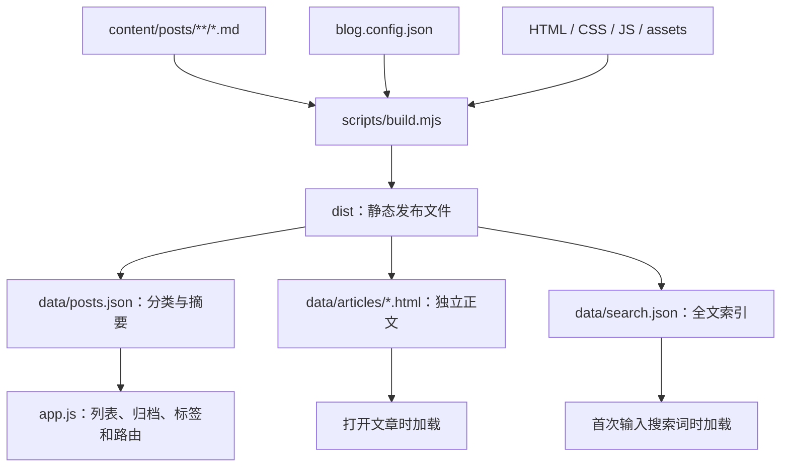

# MuQingCi 博客项目架构与维护指南

本文说明当前“一篇文章一个 Markdown 文件”的架构、代码实现，以及日常写作和扩展方法。前端继续使用原生 HTML、CSS、JavaScript；文章在构建阶段转换，发布结果是静态文件。

## 1. 整体架构与目录

项目分为三个部分：源文件、构建工具和浏览器前端。

- 源文件保存文章、分类配置、页面和样式，是平时修改的对象。
- Node.js 构建工具解析文章，生成摘要索引、独立正文和搜索索引。
- 浏览器先读取摘要，打开文章时加载正文，首次搜索时加载全文索引。

Node.js 与解析库只用于开发和构建，访客不需要安装它们。网站没有数据库、账号后台或评论服务。

```text
MyBlog/
├── index.html                     # 页面骨架、个人介绍、图标和动态容器
├── styles.css                     # 主题、布局、组件与响应式规则
├── app.js                         # 加载数据、路由、渲染和交互
├── blog.config.json               # 分类名称与图标
├── content/
│   └── posts/
│       └── 2026/
│           ├── a-quiet-corner.md
│           ├── Love-Story.md
│           └── ...                # 每篇文章独立保存，可继续分目录
├── assets/                        # 头像、插画和正文图片
├── scripts/
│   ├── build.mjs                   # 扫描、校验、转换和生成发布目录
│   └── serve.mjs                   # HTTP 预览、监听源文件并重新构建
├── tests/
│   └── build.test.mjs              # 构建与内容维护测试
├── .github/workflows/pages.yml     # GitHub Actions 构建和部署
├── package.json                   # 命令和构建依赖
├── package-lock.json              # 锁定依赖版本，需提交
├── .nojekyll                      # 随构建复制的静态发布标记
├── .gitignore                     # 排除生成结果、依赖和临时工具
├── README.md                      # 预览、写作和发布的快速说明
├── 项目架构与维护指南.md           # 本文
└── dist/                          # 自动生成的完整发布目录，不手动编辑
```

旧的 `posts.js` 内容已迁移到 `content/posts/2026/`，不再维护文章数组。迁移以当前工作区的 7 篇文章为准，保留 `Love-Story` 等原 ID、元数据及正文，也保留姓名“木青辞”和当前个人介绍。

本地可能存在忽略的 `.preview/`，用于临时浏览器验证与截图；它不属于项目依赖，其他人检出仓库后不需要它。



## 2. 一篇文章如何保存

每个 `.md` 文件由 YAML 元数据和 Markdown 正文组成。顶部两个 `---` 包围元数据，后面写正文。

````markdown
---
id: my-new-post
title: 我的新文章
description: 一段用于卡片展示的简短介绍。
date: 2026-09-28
category: tech
tags: [JavaScript, 前端]
cover: code
featured: false
sample: false
---

这里是文章开头。

## 小标题

正文支持 **加粗**、列表、链接和图片。

```javascript
console.log("Hello, blog!");
```
````

| 字段 | 必填 | 含义和约束 |
| --- | --- | --- |
| `id` | 是 | 唯一文章标识，英文字母或数字开头，后续允许连字符和下划线；大小写也不能重复 |
| `title` | 是 | 标题，非空字符串 |
| `description` | 是 | 卡片摘要，非空字符串 |
| `date` | 是 | 有效的 `YYYY-MM-DD` 日期，决定排序和归档年份 |
| `category` | 是 | `blog.config.json` 中的分类 ID |
| `tags` | 是 | 字符串数组，可为空；同一篇文章不能重复标签 |
| `cover` | 是 | 现有封面类型，见下文 |
| `minutes` | 否 | 正整数；省略时按正文纯文本长度每 400 字估算，至少 1 分钟 |
| `featured` | 否 | 布尔值，默认 `false`；整个博客最多一篇 `true` |
| `sample` | 否 | 布尔值，默认 `false`；`true` 显示示例标记 |

当前分类为 `tech`、`life`、`reading`。现有封面为 `code`、`garden`、`git`、`books`、`grid`、`journal`、`mountains`。

文章链接使用 `/#article/文章ID`。文件可以改名或移动目录，已发布文章的 ID 应保持稳定。`Love-Story` 的大写会原样保留，读取链接时区分大小写。

元数据未知字段、无效日期、重复 ID、多篇精选等问题会让构建失败，并给出错误。单篇文章错误包含源文件路径，方便直接定位。不要把 `false` 写成字符串 `"false"`。

正文图片放在 `assets/`，例如 ``。正文 HTML 插入当前页面，所以图片路径相对于网站入口，不相对于 Markdown 文件所在目录。

Markdown 支持原始 HTML，构建没有额外的 HTML 清洗步骤；当前内容由仓库作者维护。代码围栏中的 HTML 会作为代码显示。解析行为遵循 Markdown 规则，例如中文加粗内容后紧接文字时，可在结束标记后加空格：`**技术笔记：** 学习记录`。

## 3. 构建代码的实现思路

`package.json` 提供三个主要命令：

| 命令 | 用途 |
| --- | --- |
| `npm run build` | 执行 `scripts/build.mjs`，生成 `dist/` |
| `npm run dev` | 首次构建后启动本地预览，并监听源文件 |
| `npm test` | 使用 Node.js 测试工具验证构建行为 |

`build.mjs` 导出 `buildSite(root)`，正常运行使用项目根目录，测试可以传入独立临时目录。其步骤为：

1. 读取分类配置，检查分类 ID、名称和图标是否有效。
2. 递归扫描 `content/posts/` 内的 `.md` 文件，目录层级不影响收录。
3. 使用 `yaml` 解析元数据，检查字段、类型、重复 ID 和精选数量。
4. 使用 `marked` 转换 Markdown 为 HTML，并从解析后的 token 提取搜索用纯文本。
5. 按日期倒序排列，日期相同则按 ID 排序。
6. 所有内容校验通过后清理当前项目的 `dist/`，复制前端和资源，写入生成文件。

生成目录中的数据是：

```text
dist/data/
├── posts.json
├── search.json
└── articles/
    └── 文章ID.内容指纹.html
```

- `posts.json` 包含 `{ categories, posts }`，每篇仅保存元数据及 `contentUrl`，没有正文和搜索文本。
- `search.json` 保存 `{ id, text }` 数组。文本包含标题、摘要、标签及正文，代码、列表和表格内容也可搜索。
- 每篇正文独立生成 HTML，文件名包含正文 SHA-256 的前 12 位。正文变化后 URL 变化，避免继续使用旧正文缓存。

增删修改都以源目录当前内容为准，重新构建会清理旧生成正文。文章校验失败时，尚未清理发布目录，上一次成功输出会保留。这个保证针对内容校验失败，不代表文件复制或磁盘写入失败也能完整回滚。

构建仅复制页面、样式、脚本、`.nojekyll` 与 `assets/`，不会发布 Markdown 源文、开发依赖或测试。

## 4. 前端如何加载与交互

### 4.1 初始化和渲染

`index.html` 用 `defer` 加载 `app.js`。脚本先请求 `data/posts.json`，再计算标签统计、生成分类筛选、精选区和首页文章列表，并绑定事件与处理当前路由。

索引加载失败时显示加载失败页面和刷新按钮。如果通过 `file://` 打开，会提示使用本地预览服务。

`app.js` 中的主要职责如下：

| 函数 | 职责 |
| --- | --- |
| `articleCard()`、`cover()` | 生成文章卡片与封面 |
| `renderFeatured()` | 从 `featured` 元数据生成精选标题、摘要、日期和链接；无精选时隐藏区域 |
| `renderHome()` | 排除精选文章后按分类展示普通卡片，更新可见数量 |
| `renderArchive()` | 将所有文章按年份归档 |
| `renderTags()` | 展示标签与对应文章 |
| `renderArticle()` | 生成文章页框架，再异步加载对应正文 |
| `route()` | 解析 hash、显示页面、更新导航、标题和焦点 |
| `search()` | 加载并查询全文索引，生成搜索结果 |
| `applyTheme()`、`setMenu()` | 切换主题与手机导航 |

精选文章显示在单独的精选区域，因此首页普通卡片数可能小于文章总数。归档、标签和统计仍包含精选文章。

### 4.2 路由与正文加载

| 地址片段 | 页面 |
| --- | --- |
| `#home` 或无 hash | 首页 |
| `#archive` | 文章归档 |
| `#tags` | 全部标签 |
| `#tags/标签名` | 某个标签的文章 |
| `#about` | 静态个人介绍 |
| `#article/文章ID` | 单篇文章 |

未知路由、无效编码或不存在的文章显示未找到页面。hash 不产生服务器子路径，因此文章链接可以直接访问和刷新。

正文加载时显示等待提示，失败时提供重新加载按钮。每次路由变化会取消之前的请求，并通过路由版本检查阻止过期结果覆盖当前文章，避免快速切换时正文串页。

文章链接复制使用浏览器剪贴板 API，失败时提示从地址栏复制。相关事件绑定在稳定的父容器上，正文替换后按钮仍可响应。

### 4.3 搜索、主题和响应式布局

搜索支持按钮及 `Ctrl/Command + K`。空输入显示最近文章；首次输入关键词才下载全文索引，成功后在当前页面缓存。匹配方式是大小写不敏感的子串查找，包含正文；未匹配时显示提示，失败后重新输入会再次尝试。

搜索也使用请求版本检查，较早关键词的结果不会覆盖较新关键词的结果。输入框按 Enter 打开首个结果，Escape 关闭原生 `dialog`。

主题通过 `data-theme` 和 CSS 变量控制，偏好保存到 `localStorage`。手机导航使用遮罩、`inert`、焦点控制和键盘处理；760px 及以下启用抽屉导航，具体断点见 `styles.css`。

元数据插入多数动态模板前使用 `escapeHTML()`；正文 HTML 来自作者 Markdown 构建结果。新增模板时应延续对文本转义的处理。

## 5. 日常新增、修改、删除和查找

首次检出项目需要 Node.js 22 或更高版本，建议使用 24：

```powershell
npm ci
npm run dev
```

打开 `http://127.0.0.1:4173/`。保存文章、`index.html`、`styles.css`、`app.js`、分类配置或 `assets/` 后会自动重新构建，刷新浏览器查看；按 Ctrl + C 停止。修改构建脚本后需重启服务。

日常操作只涉及相应源文件：

- 新增：在 `content/posts/年份/` 创建 `.md`，填写元数据与正文。没有额外文章清单需要登记。
- 修改：编辑原文件；保持已公开的 ID 稳定。
- 删除：删除对应 `.md`；重建后列表、搜索与旧正文一起更新。
- 查找：使用编辑器文件查找和全文搜索，或执行下面的 `rg` 命令。
- 更换精选：取消原文章的 `featured: true`，为目标文章设置它。若自动构建暂时看到两篇精选，会报错；保存正确状态后会恢复。
- 修改标签：编辑文章 `tags` 数组，统计与标签页面随构建和刷新更新。

```powershell
rg --files content/posts
rg -n "两性情感" content/posts
rg -n "^id: Love-Story$" content/posts
```

不运行预览服务时，执行 `npm run build` 更新发布目录。不要修改 `dist/` 内文件；下次构建会覆盖它们。

## 6. 如何修改页面或扩展实现

| 修改需求 | 主要位置 | 配套调整 |
| --- | --- | --- |
| 姓名、简介、GitHub 链接、随记 | `index.html` | 保留脚本依赖的容器 ID |
| 配色、字号、间距、手机布局 | `styles.css` | 同时查看浅色、深色和手机效果 |
| 分类名称与图标 | `blog.config.json` | 图标名称须对应 `index.html` 的 `icon-*`；关于页介绍手动同步 |
| 文章内容与标签 | `content/posts/**/*.md` | 重建并刷新 |
| 排序 | `scripts/build.mjs` | 当前按日期倒序，检查归档与搜索显示顺序 |
| 搜索匹配规则 | `app.js` 的 `search()` | 如需新的索引信息，同时改构建输出 |
| 相关文章规则 | `renderArticle()` | 当前优先同分类，取其他文章中的前两篇 |
| 新封面 | `app.js` 的 `cover()`、`styles.css` | 在 `build.mjs` 的封面允许集中加入名称 |
| 新文章字段 | `build.mjs` 的字段集与校验、文章文件 | 按需要调整前端模板、测试和文档 |
| 新页面 | `index.html`、`app.js`、`styles.css` | 增加 `.page` 容器，并更新路由与导航 |

新增分类示例：在 `blog.config.json` 的 `categories` 下增加 `"notes": { "name": "学习记录", "icon": "code" }`，文章使用 `category: notes`。分类筛选和数量自动生成；新的分类 ID 不应使用筛选保留值 `all`。

如果希望新分类有单独颜色，再补充 `.card-category.notes` 样式。无需为每个分类增加另一份文章数组。

当前分类封面的插画大多由 HTML/CSS 绘制，山峦等使用 SVG。精选区域使用现有山峦背景，标题等随精选元数据变化。

文章较多时，源码维护不再集中在一个数组中，首页也不会下载所有正文。但摘要索引仍包含全部文章，当前列表一次生成全部卡片，首次搜索也会下载完整全文索引。若数据规模使这些操作明显变慢，再增加分页或分片搜索；本次没有引入这些额外功能。

hash 路由和浏览器渲染也意味着每篇文章没有独立的静态页面 HTML。若后续希望每篇文章独立设置搜索引擎摘要、社交分享预览，可再扩展构建阶段生成独立页面。

## 7. 验证与发布

构建和检查命令：

```powershell
npm test
npm run build
```

`tests/build.test.mjs` 使用临时目录验证：递归扫描、Markdown 转换、全文索引、元数据校验、重复 ID、精选约束，以及新增、修改和删除时的索引更新与旧正文清理。测试不修改真实文章。

这次迁移还进行了本地浏览器验证：7 篇文章元数据、正文文本及代码块与迁移前一致；首页不请求正文和搜索索引；筛选、全文搜索、直接文章链接、重试、主题和手机导航可用；在 320–1920px 的 12 个宽度下检查了 5 类页面无横向溢出。这些是本地结果，不表示线上部署已完成。

`.github/workflows/pages.yml` 在推送 `main` 或手动触发后执行：

1. 检出源码，安装 Node.js 24。
2. 用 `npm ci` 安装锁定依赖。
3. 执行测试和构建。
4. 上传 `dist/`，发布到 GitHub Pages。

首次启用需在仓库 **Settings → Pages → Build and deployment → Source** 选择 **GitHub Actions**。不能继续按源码根目录直接发布，因为根目录没有生成的文章数据。

提交时包含 Markdown、前端、脚本、配置、工作流和锁文件，旧 `posts.js` 的删除也需提交；不要提交 `dist/`、`node_modules/` 或 `.preview/`。具体首次迁移命令见 README。执行提交前查看 Git 差异，保留其他正在进行的工作。

每次发布后在 Actions 查看结果，再打开线上首页及一篇文章验证。本次已准备本地代码和工作流，未推送，也未修改远程 Pages 设置。

参考：[GitHub Pages 自定义工作流](https://docs.github.com/en/pages/getting-started-with-github-pages/using-custom-workflows-with-github-pages)、[marked 官方仓库](https://github.com/markedjs/marked)、[yaml 官方文档](https://eemeli.org/yaml/)。